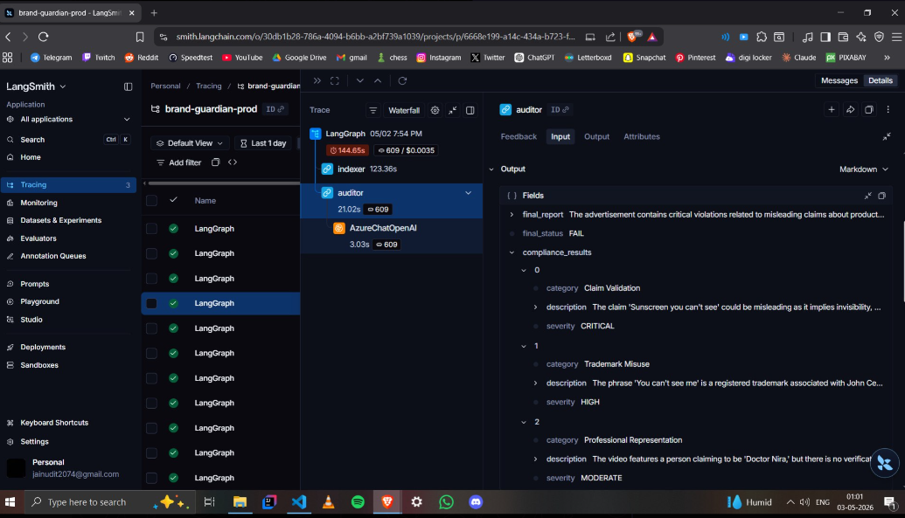
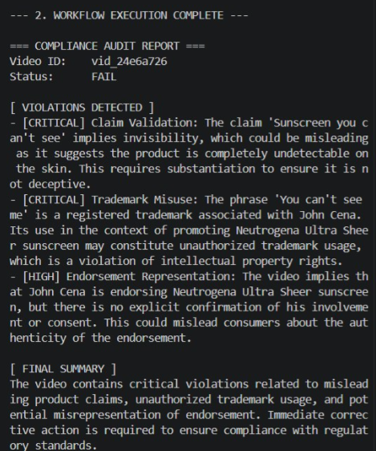

# 🛡️ Brand Guardian — Video Compliance QA Pipeline (Azure LLMOps)

An end-to-end **Multimodal LLMOps system** that audits YouTube videos for compliance violations using **RAG + LangGraph + Azure AI services**.

---

## 🚀 Overview

Brand Guardian analyzes video content to detect:

* Missing **FTC disclosures**
* Misleading claims
* Violations of **YouTube Ad policies**

It combines **video understanding + retrieval + LLM reasoning** to generate structured compliance reports.

---

## 🧠 Architecture

```
YouTube Video
   ↓
Download (yt-dlp)
   ↓
Azure Video Indexer (Transcript + OCR)
   ↓
Text Processing (Transcript + On-screen text)
   ↓
Chunking
   ↓
Embeddings (Azure OpenAI)
   ↓
Azure AI Search (Vector DB)
   ↓
RAG (Retrieve Compliance Rules from PDFs)
   ↓
GPT-4o Reasoning
   ↓
Structured JSON Compliance Report
```

---

## ⚙️ Tech Stack

### 🧩 Core AI

* LangGraph (Workflow orchestration)
* LangChain (RAG pipeline)

### ☁️ Azure Services

* Azure OpenAI (GPT-4o + embeddings)
* Azure AI Search (Vector database)
* Azure Video Indexer (transcription + OCR)
* Azure Application Insights (telemetry)

### 🔧 Backend

* FastAPI
* Pydantic
* Python 3.11

---

## 🔄 Workflow (LangGraph)

```
START
  ↓
[Indexer Node]
  - Download video
  - Upload to Azure Video Indexer
  - Extract transcript + OCR
  ↓
[Auditor Node]
  - Retrieve rules (RAG)
  - Analyze with GPT-4o
  - Generate compliance results
  ↓
END
```

---

## 📂 Data Sources (RAG)

* FTC Influencer Disclosure Guide
* YouTube Ad Specifications

---

## 📊 Observability

Integrated **Azure Monitor (OpenTelemetry)**:

* Tracks API requests automatically
* Logs errors and performance
* Captures dependency calls (Azure Search, OpenAI)
* Provides end-to-end trace of pipeline

---

## 🧪 API Endpoints

### 🔹 Audit Video

```http
POST /audit
```

**Request**

```json
{
  "video_url": "https://youtu.be/..."
}
```

**Response**

```json
{
  "session_id": "...",
  "video_id": "...",
  "status": "FAIL",
  "final_report": "...",
  "compliance_results": [
    {
      "category": "FTC_DISCLOSURE",
      "severity": "CRITICAL",
      "description": "Missing disclosure"
    }
  ]
}
```

---

### 🔹 Health Check

```http
GET /health
```

---

## 🖥️ CLI Execution

```bash
python main.py
```

Runs full pipeline:

* Video → Analysis → Compliance Report

---

## 📸 Sample Output

* Structured JSON violations

* PASS / FAIL status
* AI-generated summary

---

## 💡 Key Learnings

* Multimodal pipelines require **orchestration (LangGraph)**
* RAG is essential for **grounded reasoning**
* Observability is critical for debugging AI systems
* Structured outputs enable real-world usage
* Azure accelerates development but introduces cost constraints

---

## ⚠️ Version Note

This is the **Azure-based implementation** of Brand Guardian.

A future version will:

* Replace Azure services with **open-source / free alternatives**
* Enable **zero-cost deployment**

---

## 🛠️ Setup

1. Clone repo

```bash
git clone <repo-url>
```

2. Create `.env` file with:

* Azure OpenAI credentials
* Azure Search keys
* Video Indexer configs
* Application Insights connection

3. Run indexing:

```bash
python backend/scripts/index_documents.py
```

4. Start API:

```bash
uv run uvicorn backend.src.api.server:app --reload
```

---

## 📌 Future Work

* Replace Azure with:

  * Whisper (ASR)
  * FAISS (vector DB)
  * Open-source LLMs / APIs
* Deploy full system (zero-cost stack)

---

## 👨‍💻 Author

Built as a **hands-on LLMOps project** to explore:

* Multimodal AI pipelines
* RAG systems
* Observability in AI applications
